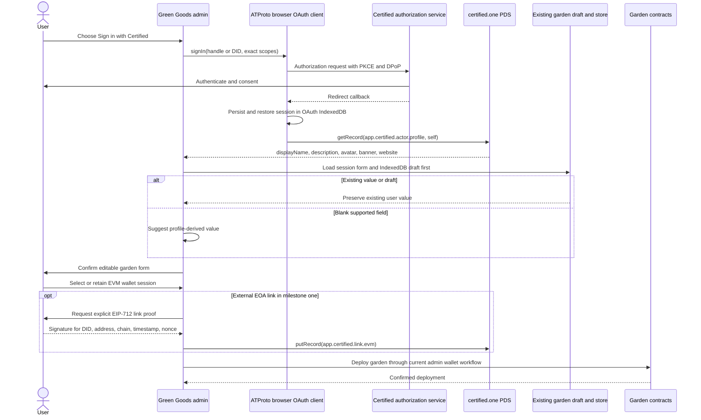
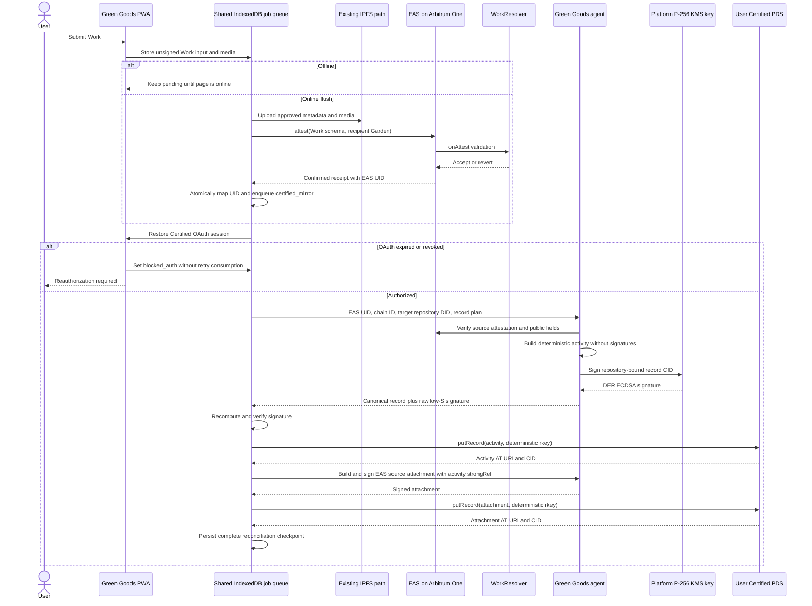

# Green Goods x Certified ATProto integration spec

Date: 2026-07-13  
Status: Explore and spec complete, implementation not approved  
Primary topology: Certified owns the DID and PDS, Green Goods is an OAuth client

## 1. Claim labels and source boundary

- **[D] Documented:** verified in the Green Goods repository, a pinned upstream release or revision, or official AT Protocol documentation.
- **[I] Inferred:** a reasoned conclusion from documented evidence.
- **[S] Speculative:** a proposed implementation or policy that remains to be approved or tested.

Material statements below carry one of these labels. A label applies to the paragraph, list item, table row, or diagram note that contains it.

### Upstream material used

**[D]** The schema authority for this pass is the `hypercerts-org/hypercerts-lexicon` Git tag `v1.1.0`, released 2026-07-06. The pass read `SCHEMAS.md`, `LEXICON_STYLE_GUIDE.md`, `STRING_CONSTRAINTS.md`, the complete `lexicons/` tree, and the bundled `building-with-hypercerts-lexicons` skill from that tag.

**[D]** On 2026-07-13, npm `latest` for `@hypercerts-org/lexicon` resolved to `1.0.0`, not `1.1.0`. Implementation must not claim an npm v1.1.0 pin until it is published. If implementation starts earlier, the tagged Git dependency requires explicit supply-chain approval. `main` is not an allowed source.

**[D]** The exact requested `npx skills add hypercerts-org/hypercerts-lexicon` installer could not run in this environment because the local `npx` and mise path attempted writes outside the workspace. The pinned v1.1.0 release archive was downloaded read-only, and its bundled skill was read and applied. No repository dependency or application code was changed by that workaround.

**[D]** The Certified application was inspected at commit [`6788152c3c6318c3384633b9ccc26d512ed2469e`](https://github.com/hypercerts-org/certified-app/tree/6788152c3c6318c3384633b9ccc26d512ed2469e). The ePDS implementation was inspected at commit `1c931c113507a1fcb477090076120660024c8848`. A live `certified.one` authorization against a real account was not available, so deployed third-party scope support remains unconfirmed.

## 2. Executive decisions

1. **[I] Identity:** Certified keeps DID and PDS ownership. Green Goods adds a separate Certified session beside EVM auth, not a fourth `TransactionSender` mode.
2. **[I] PDS writes:** the browser PWA writes through user-delegated OAuth. The agent verifies the onchain source and returns a platform signature. The agent does not retain the user's OAuth refresh credentials.
3. **[I] Ordering:** confirm the EAS attestation first, extract its EAS UID from the receipt, then enqueue and execute the PDS mirror.
4. **[I] Trigger:** the shared/client job queue triggers the mirror. Envio is explicitly outside the EAS boundary.
5. **[I] Address rule:** DID-to-EVM links are additive and per address. Milestone one links an external EOA only. Switching auth modes never silently replaces a prior link.
6. **[I] Passkey proof:** milestone one uses no `app.certified.link.evm` record for a Kernel passkey account. Durable support requires upstream ERC-1271 and ERC-6492 proof variants.
7. **[S] Provenance:** one long-lived Green Goods P-256 key signs all supported record CIDs from managed KMS or HSM custody.
8. **[I] Schema mapping:** a Garden is an `org.hypercerts.collection` with type `project`. It is not normally the singleton `app.certified.actor.organization` record in a person's repo.
9. **[I] Cross-reference:** the PDS side contains an EAS source URI. The current immutable Work attestation cannot later be edited with an AT URI or CID. A durable onchain backlink needs a new follow-up EAS schema and is outside milestone one.
10. **[S] Pattern C:** a Green Goods-issued `did:web` for people without Certified identities is outside the first milestone and initial delivery.

The shorter identity decision is recorded in [Certified ATProto Identity Topology Memo](./certified-atproto-topology-memo-2026-07.md).

## 3. Corrections to the initial premises

| Premise                                                                                | Verified result                                                                                                                                                                               | Consequence                                                                                                  | Claim |
| -------------------------------------------------------------------------------------- | --------------------------------------------------------------------------------------------------------------------------------------------------------------------------------------------- | ------------------------------------------------------------------------------------------------------------ | ----- |
| Embedded email/social transactions are already sponsored through EIP-5792 and ERC-7677 | The current embedded sender marks sponsorship false and uses a standard wallet contract write; EIP-5792 sponsorship is described as future work                                               | Do not rely on embedded sponsorship or batch behavior in this integration                                    | [D]   |
| Passkey and wallet attestations are signed offline                                     | The queue stores unsigned Work or Approval input and media. Encoding, IPFS upload, and transaction sending occur only during an online flush                                                  | The PDS mirror must extend the same draft/job queue and must not assume a pre-existing offline EAS signature | [D]   |
| All three resolvers enforce ActionRegistry validity                                    | Work and WorkApproval consult ActionRegistry. Assessment validates evaluator/operator authorization and assessment fields but does not consult ActionRegistry                                 | Mirror validation must be schema-specific                                                                    | [D]   |
| Envio indexes EAS attestations                                                         | The indexer guide explicitly excludes EAS. Shared reads EAS through its GraphQL client                                                                                                        | Envio cannot be the mirror trigger                                                                           | [D]   |
| A Garden is naturally an `actor.organization` record                                   | `app.certified.actor.organization` is a singleton extension of the repository actor and has no display-name field. `org.hypercerts.collection` is multi-record, recursive, and project-shaped | Use `collection` for gardens. Reserve `organization` for an organization-owned DID                           | [D]   |
| Work records can directly list attachments                                             | `activity` has no attachment property. Attachment records point to subjects through strong references                                                                                         | Write the activity first, then write attachments that reference it                                           | [D]   |

## 4. Current Green Goods architecture

### 4.1 Auth and transaction control

**[D]** `AuthMode` is the mutually exclusive union `wallet | passkey | embedded | null`. `usePrimaryAddress` resolves the external wallet EOA, passkey Kernel address, or embedded wallet address based on that mode. `TransactionSender` is an EVM contract-call interface that returns transaction hash and sponsorship status.

**[D]** Current session metadata is client-local. `packages/shared/src/modules/auth/session.ts` stores auth mode, passkey credential metadata, expected Kernel address, embedded address, and sign-out sentinel in `localStorage`. The shared auth actor and `AuthProvider` hold runtime state.

**[I]** A Certified OAuth session is orthogonal to EVM transaction control. It establishes a DID and PDS authorization, not a blockchain signer. Adding `certified` to `AuthMode` would wrongly make the user choose between identity and transaction control.

**[S]** Add `CertifiedSessionProvider` beside the existing `AuthProvider`. Its public state is limited to DID, handle, session readiness, authorization capability, and reauthorization status. Use `@atproto/oauth-client-browser` for the PWA. Let the library store DPoP and refresh material in its own IndexedDB implementation. Green Goods stores only a non-secret active-DID pointer and product state. The service worker must never receive OAuth access or refresh tokens.

**[D]** The official browser OAuth client supports `init()` callback handling, DID-based session restore, token refresh, and IndexedDB persistence. Official guidance prefers the Node client and backend-for-frontend when a backend can safely own the session, but the requested client-writes-to-PDS topology specifically keeps user delegation in the browser.

### 4.2 Address continuity

**[D]** The three Green Goods modes can resolve to three addresses. The passkey mode resolves to the Kernel smart account, not the P-256 authenticator key. The existing code treats the active mode's address as the source of truth for membership and transaction ownership.

**[I]** `app.certified.link.evm` should represent an append-only set of explicit address consents for one DID. The product may display a preferred Green Goods address, but preference is not cryptographic revocation.

**[S]** Address-link rule:

- construct a deterministic record key from the normalized address and proof variant
- require an explicit consent action by that exact account
- retain earlier records when the active mode changes
- permit a user-requested unlink by deleting or superseding the individual record, subject to Certified conventions
- never infer a Kernel link from an EOA proof, or an EOA link from an OAuth session
- show the linked mode and address before submission

### 4.3 Offline job queue

**[D]** The IndexedDB database is `green-goods-job-queue`, currently version 5. A job has a kind, payload, retry fields, chain ID, sync flag, and `userAddress`. The only typed kinds are `work` and `approval`. The queue is scoped by the active primary address.

**[D]** The service worker does not execute blockchain or PDS writes. It signals the page to attempt a flush. The page provider owns the `TransactionSender`, current user address, online checks, retries, and UI state.

**[I]** The Certified mirror belongs in the same database and processor, but OAuth secrets do not belong in the job payload. A job must be able to wait for online state or reauthorization without being treated as a failed blockchain job.

**[S]** Proposed mirror job shape:

```ts
interface CertifiedMirrorJobPayloadV1 {
  version: 1;
  repositoryDid: string;
  source: {
    chainId: number;
    easUid: `0x${string}`;
    schemaUid: `0x${string}`;
    txHash: `0x${string}`;
  };
  visibilityDecision: "public";
  recordPlan: "work-v1";
  deterministicKeys: {
    activity: string;
    sourceAttachment: string;
  };
  checkpoint:
    | { stage: "source_confirmed" }
    | { stage: "activity_written"; activity: { uri: string; cid: string } }
    | {
        stage: "complete";
        activity: { uri: string; cid: string };
        sourceAttachment: { uri: string; cid: string };
      };
}
```

**[I]** The existing `userAddress` remains the queue owner for compatibility, while `repositoryDid` in the payload binds the PDS target. Before processing, both the current EVM address and restored Certified DID must match. A future queue schema can promote DID to an indexed owner if multiple identities on one device become a product requirement.

**[S]** Add explicit non-terminal states `blocked_offline`, `blocked_auth`, and `blocked_provider_capability`. These states do not consume the existing retry budget. Record and server failures use bounded exponential retry. An invalid or revoked OAuth session pauses only PDS work and prompts the user to reauthorize after the app returns to the foreground.

### 4.4 EAS path and trigger point

**[D]** Work and WorkApproval are encoded in shared code and sent through `TransactionSender`. The current job executors return only the transaction hash. The EAS transaction builder sets `refUID` to zero for Work, WorkApproval, and their batch variants.

**[D]** Assessment uses the EAS SDK directly and already awaits `attestResult.wait()` to receive the attestation UID.

**[D]** `WorkResolver` validates the schema, gardener or operator authorization, title, metadata CID, active action, and enabled garden domain. `WorkApprovalResolver` validates the referenced Work, operator authorization, no self-approval, action status, approval constraints, and optional Karma GAP integration. `AssessmentResolver` validates evaluator or operator authorization and assessment fields.

**[I]** The exact mirror trigger is after a confirmed receipt and successful extraction of the EAS `Attested` event UID. It must be before the Work job is deleted. The transaction hash is not an EAS UID and must not continue to be stored as though it were one.

**[S]** Add a shared receipt helper that waits for the receipt and parses the EAS `Attested(recipient, attester, uid, schemaUID)` event. In one IndexedDB transaction, persist the UID-to-transaction mapping and insert the mirror job, then mark or remove the Work job. If the browser stops between confirmation and that transaction, a recovery pass queries the receipt by transaction hash.

**[I]** Trigger ownership:

- Client/shared queue: owns the user's OAuth session, job ordering, and PDS write.
- Agent: verifies public EAS source data, constructs or confirms the canonical public record, and signs its CID.
- Envio: no role in EAS mirroring.
- Shared EAS data layer: read and reconciliation source through EAS GraphQL where receipt data is not enough.

### 4.5 Existing hypercerts code

**[D]** `packages/shared/src/hooks/hypercerts` builds and submits legacy onchain HypercertMinter flows, allowlists, IPFS metadata, and marketplace interactions. The related data modules query onchain hypercert/indexer data. No AT Protocol, Certified, or PDS writer exists in that hook tree.

**[I]** The new ATProto integration must be a separate `modules/certified` boundary. It may reuse Green Goods domain types and IPFS URIs, but it must not wrap or rename the existing onchain hypercert hooks.

### 4.6 Garden and gardener records

**[D]** The canonical shared `Garden` includes chain ID, Garden token address and token ID, name, location, banner, description, roles, works, assessments, joining policy, and domain mask. The create form includes name, slug, description, location, banner, metadata, open joining, domains, gardeners, and operators.

**[D]** Garden creation is currently an admin flow. Its controller restores existing form state or an IndexedDB draft and refuses deployment while offline. The workflow uses the current admin wallet deployment path rather than the shared `TransactionSender` abstraction.

**[D]** The shared gardener-profile hook describes an onchain profile with name, bio, location, image URI, social links, and contact information. Its read path is not a Certified or AT Protocol profile.

**[I]** Certified profile prefill is a user convenience, not an assertion that the person and garden are the same entity. Existing draft values must win. Profile data fills blank fields only, and the user confirms before deployment.

| Certified profile field | Garden form target          | Rule                                                                                                               | Claim |
| ----------------------- | --------------------------- | ------------------------------------------------------------------------------------------------------------------ | ----- |
| `displayName`           | `name`                      | Suggest only when blank                                                                                            | [I]   |
| `displayName`           | `slug`                      | Locally derive, validate with the existing form schema, keep editable                                              | [S]   |
| `description`           | `description`               | Suggest only when blank and within Green Goods constraints                                                         | [I]   |
| `banner`                | `bannerImage`               | Prefer banner when it resolves to an accepted image URI or blob                                                    | [I]   |
| `avatar`                | `bannerImage`               | Optional fallback only after a product decision on cropping and attribution                                        | [S]   |
| `website`               | none today                  | Do not hide it in the raw metadata string. Add a typed garden link field in a later contract if needed             | [I]   |
| none                    | `location`                  | Do not infer. Profile has no location field. A separate, user-selected `app.certified.location` record is required | [D]   |
| none                    | domains, team, open joining | Never infer                                                                                                        | [I]   |

## 5. OAuth design

### 5.1 Client shape

**[S]** Use `@atproto/oauth-client-browser@0.4.8` in the PWA for the approved client-writes-to-PDS milestone. Initialize once at the application root. Complete callbacks before rendering identity-dependent routes. Restore by DID on subsequent loads.

**[S]** Green Goods client metadata must be served from an HTTPS URL and use a public-client configuration with exact redirect URIs. The library owns PKCE, DPoP, authorization state, and token refresh. Green Goods must not hardcode Certified token endpoints. It starts from a user-entered Certified handle or DID, resolves the protected resource and authorization-server metadata, and redirects to the discovered issuer.

**[S]** If Green Goods later moves PDS writes to a backend-for-frontend, use `@atproto/oauth-client-node@0.4.8` with an encrypted durable state/session store. That is not milestone one because it changes token custody and the write topology.

### 5.2 Scopes

**[D]** AT Protocol supports granular repository scopes of the form `repo:<collection>` with action qualifiers. Certified's current deployed acceptance of those scopes has not been verified.

**[S]** Milestone-one requested scopes:

```text
atproto
repo:app.certified.link.evm?action=create&action=update
repo:org.hypercerts.claim.activity?action=create&action=update
repo:org.hypercerts.context.attachment?action=create&action=update
```

**[S]** Later milestones add only the collections they implement:

```text
repo:org.hypercerts.collection?action=create&action=update
repo:app.certified.location?action=create&action=update
repo:org.hypercerts.context.measurement?action=create&action=update
repo:org.hypercerts.context.evaluation?action=create&action=update
repo:org.hypercerts.context.acknowledgement?action=create&action=update
repo:org.hypercerts.workscope.tag?action=create&action=update
repo:org.hypercerts.workscope.cel?action=create&action=update
```

**[I]** Profile reading can use the public `com.atproto.repo.getRecord` path when the repository exposes `app.certified.actor.profile/self`. If Certified requires a permission set for this read, its published permission set must replace the assumed scope before implementation.

**[I]** `transition:generic` is too broad for the durable design. It may be used only in a time-bounded interoperability spike if Certified explicitly requires it and the scope is reviewed before production.

### 5.3 Provider failure fallback

**[I]** If Certified authenticates Green Goods but does not grant record writes, Flow A can still support profile pull. Flow B remains blocked. Green Goods must keep the confirmed EAS source and a resumable `blocked_provider_capability` job, show the limitation honestly, and avoid any credential-sharing workaround.

**[I]** Pattern C does not solve this failure for an existing Certified user. A Green Goods DID would be a different identity and repository.

## 6. Flow A sequence: Certified SSO, profile pull, and garden creation



**[D]** The current Garden deployment is online-only and admin-wallet-specific. Certified SSO does not replace the required EVM session.

**[S]** Garden collection creation is milestone two, after the minimal Work mirror. When enabled, create an `org.hypercerts.collection` record with type `project` after the Garden address is known.

## 7. Flow B sequence: EAS Work to signed PDS mirror



**[I]** The platform signing endpoint must derive or verify all signed fields from the confirmed EAS source and approved mapping rules. It must not sign an arbitrary record body or caller-supplied CID.

## 8. EAS-to-lexicon schema crosswalk

### 8.1 Crosswalk table

| Green Goods source            | Lexicon record and fields                                                                                                                                                       | Relationship and cross-reference                                                                                                  | Validation or loss                                                                                                                                             | Claim |
| ----------------------------- | ------------------------------------------------------------------------------------------------------------------------------------------------------------------------------- | --------------------------------------------------------------------------------------------------------------------------------- | -------------------------------------------------------------------------------------------------------------------------------------------------------------- | ----- |
| Garden                        | `org.hypercerts.collection`: `type = project`, `title = name`, `shortDescription` or `description`, `banner`, `createdAt`, optional `location` strongRef                        | Deterministic collection rkey from chain ID plus Garden address. Add Work activities as weighted or unweighted `items` strongRefs | `collection` supports multiple project records and recursive nesting. It has no GardenAccount, Hats, or role fields                                            | [I]   |
| Organization-owned Garden DID | `app.certified.actor.profile/self` plus optional `app.certified.actor.organization/self`                                                                                        | Only when the housing DID is itself the organization                                                                              | The singleton organization record is not the default representation for multiple gardens in a person's repo                                                    | [D]   |
| GardenAccount and Hats        | Evidence attachment with explorer or canonical contract URI                                                                                                                     | Attachment subjects the Garden collection                                                                                         | No dedicated v1.1.0 fields. Do not invent them                                                                                                                 | [I]   |
| Work                          | `org.hypercerts.claim.activity`: `title`, `shortDescription` from public feedback, `createdAt` from chain time, optional contributors, dates, work scope, locations, signatures | Collection item strongRef from Garden to Work when collection support is enabled                                                  | `activity` has no direct EAS UID or attachment field                                                                                                           | [D]   |
| Work media CID                | `org.hypercerts.context.attachment`: `subjects = [activity strongRef]`, `contentType = evidence`, `content = ipfs://<cid>`, title, createdAt                                    | Attachment points to activity                                                                                                     | Copy only media approved for public PDS visibility                                                                                                             | [I]   |
| Work metadata CID             | `attachment` with `contentType = methodology` or `evidence`, `content = ipfs://<cid>`                                                                                           | Attachment points to activity                                                                                                     | Use `methodology` only when the content actually describes method. Otherwise use `evidence`                                                                    | [I]   |
| Work numeric detail           | `org.hypercerts.context.measurement`: `subjects`, `metric`, `unit`, numeric-string `value`, time, optional evidence URIs and measurer DIDs                                      | Measurement points to activity; evaluation can later reference it                                                                 | Mirror only typed numeric values with an explicit unit. Current arbitrary details are not automatically valid measurements                                     | [I]   |
| Work EAS source               | `attachment`: subject activity, `contentType = evidence`, `content` contains a stable HTTPS EAS viewer URI, title contains schema identity, createdAt from chain                | Deterministic rkey from `eip155:<chainId>:eas:<uid>`                                                                              | This carries chain ID and UID without inventing lexicon fields                                                                                                 | [I]   |
| WorkApproval                  | `org.hypercerts.context.evaluation`: `subject = activity strongRef`, `evaluators`, `summary`, `score { min: "0", max: "3", value: confidence }`, optional content attachment    | Evaluation references activity snapshot                                                                                           | `evaluators` require DIDs. Do not place an EVM address in a DID field. No exact approved boolean or verification-method field exists, so this mapping is lossy | [I]   |
| WorkApproval review notes CID | Evaluation `content` URI or an attachment strongRef pattern supported by the app                                                                                                | Bind to evaluation or activity as the chosen subject                                                                              | Verification method may be explained in summary or review evidence but must not be invented as a schema property                                               | [I]   |
| Assessment                    | `org.hypercerts.context.evaluation`: subject Garden collection, evaluator DIDs, summary, config or report URI, measurement strongRefs, score only when a real scale exists      | Evaluation points to the Garden project snapshot                                                                                  | Existing assessment domain and reporting period belong in the report content or scoped collection, not unrecognized fields                                     | [I]   |
| Reporting-period scope        | Nested `org.hypercerts.collection` containing activity strongRefs for the domain and period                                                                                     | Garden collection can include the period collection                                                                               | Add only when the grouping has product meaning beyond one assessment                                                                                           | [S]   |
| Domain or action taxonomy     | `org.hypercerts.workscope.tag`, later referenced through `org.hypercerts.workscope.cel`; milestone one uses activity free-string work scope                                     | Prefer canonical known values when they fit                                                                                       | `knownValues` is open, so custom values are wire-valid but lose canonical bucketing. `enum` would be closed                                                    | [D]   |
| Contributor acceptance        | `org.hypercerts.context.acknowledgement` in the acknowledging actor's repo                                                                                                      | Subject and optional context use strongRefs                                                                                       | This is for a record relationship acknowledgement. It is not an EAS backlink and not a substitute for WorkApproval                                             | [D]   |
| Funding                       | `org.hypercerts.funding.receipt`                                                                                                                                                | None in current Work flows                                                                                                        | No source field in Work, WorkApproval, or Assessment supports a faithful mapping. Out of scope                                                                 | [I]   |

### 8.2 Garden mapping decision

**[D]** `org.hypercerts.collection` is keyed by TID, can represent many projects in one repository, and can recursively contain activities or collections. `app.certified.actor.organization` is a singleton actor extension and does not carry the actor display name.

**[I]** Garden maps to `collection`, type `project`. If a separate Certified DID is created for a legal or operational Garden organization, that repository may also use actor profile plus organization singleton records, with its Garden collection as a project. That is not the person-owned default.

### 8.3 Work scope

**[I]** Milestone one uses the activity free-string work-scope variant derived from the validated Garden domain and action label. This avoids creating a premature tag vocabulary. Later, stable Green Goods domain and action identifiers become tag records, and CEL composes them when set logic is needed.

**[D]** The current queued Work encoder does not consistently pass domain and action-slug options into its metadata builder. Implementation must not assume those fields are present for historical Work attestations. The agent must reconstruct them from verified ActionRegistry and Garden state when possible, or use a conservative label.

### 8.4 Cross-reference in both directions

**[I]** PDS to chain in milestone one:

- use a dedicated EAS source attachment
- set `content` to the stable chain-specific EAS viewer URI containing the UID
- keep chain ID, EAS UID, schema UID, and transaction hash in the local mirror-job source object
- use deterministic rkeys derived from the chain ID and EAS UID

**[D]** Current EAS attestations are immutable and use zero `refUID`. Their encoded metadata CID is fixed before the PDS record exists. The original Work attestation cannot be updated with the resulting AT URI or CID.

**[S]** Chain to PDS in the durable state uses a new follow-up EAS schema, for example `CertifiedMirrorLink`, with `refUID = source Work UID` and encoded fields for source chain ID, AT URI, and record CID. It is emitted only after the PDS write succeeds. This requires contract, schema registration, resolver, deployment, shared encoder, and read-path work. It is milestone four, not milestone one.

**[D]** Use `strongRef { uri, cid }` for every record relationship that must pin a specific version. A strongRef is a snapshot. If a referenced record is overwritten under the same rkey, the old strongRef continues to name the old CID and no longer resolves as the current record version.

**[I]** Mirrored records are append-stable. Do not overwrite an activity merely to add later evidence. Write new attachments, measurements, or evaluations that point to the original activity strongRef. A material correction creates a new record and an explicit supersession policy, which requires upstream guidance before implementation.

## 9. Smart-account EVM link proof options

### 9.1 Current gap

**[D]** `app.certified.link.evm` v1.1.0 has an open `proof` union but currently defines only `#eip712Proof`. Its fields bind DID, EVM address, chain ID, timestamp, and nonce to an EOA signature.

**[D]** Green Goods passkey users transact through a Kernel v0.3.1 smart-account address controlled by a P-256 WebAuthn credential. The smart account has no secp256k1 EOA private key for the account address.

### 9.2 Options

| Option                                                      | Feasibility                                                                                 | Benefit                                                                     | Cost or loss                                                                                                                  | Recommendation                        | Claim                                                                                                                         |
| ----------------------------------------------------------- | ------------------------------------------------------------------------------------------- | --------------------------------------------------------------------------- | ----------------------------------------------------------------------------------------------------------------------------- | ------------------------------------- | ----------------------------------------------------------------------------------------------------------------------------- | ------------------------------ | --- |
| A. ERC-1271 proof variant                                   | A deployed Kernel can validate a signature through `isValidSignature` over a defined digest | Cryptographically binds the Certified DID to the actual Green Goods account | Requires new lexicon union variant, exact digest and chain rules, deployed account, RPC verification, and upstream acceptance | Durable deployed-account path         | [I]                                                                                                                           |
| B. ERC-6492 proof variant                                   | Wrapper can prove a counterfactual smart-account signature plus deployment data             | Supports links before Kernel deployment                                     | More complex verification, factory/init-code trust, size constraints, and upstream acceptance                                 | Durable counterfactual companion to A | [I]                                                                                                                           |
| C. Link the underlying P-256 authenticator or a session key | The authenticator controls Kernel authorization but does not equal the Kernel address       | Avoids new smart-account proof at first glance                              | WebAuthn signs `authenticatorData                                                                                             |                                       | SHA256(clientDataJSON)`, not raw EIP-712 digests or record CID bytes. A session key is transient and binds the wrong identity | Reject for DID-to-account link | [D] |
| D. No passkey link in milestone one                         | OAuth still identifies the user and platform signatures still prove Green Goods provenance  | Smallest truthful slice                                                     | No cryptographic DID-to-Kernel binding for the largest user segment                                                           | Milestone-one choice                  | [I]                                                                                                                           |

### 9.3 Recommendation

**[I]** Milestone one uses option D for passkey accounts and supports `#eip712Proof` for one external EOA. Embedded-wallet linking is added only after its typed-data behavior and actual signer address are proven in the target AppKit flow.

**[S]** Durable state contributes option A and option B upstream as two explicit open-union variants. The proof message should retain DID, smart-account address, chain ID, timestamp, and nonce. Verification resolves the account bytecode and uses ERC-1271 for deployed accounts, or unwraps and validates ERC-6492 for counterfactual accounts. The exact signature envelope and replay rules must be standardized with Hypercerts before Green Goods writes records.

**[I]** What milestone one loses for passkey users is precise: there is no cryptographic assertion that the Certified DID authorized the Kernel address. OAuth still proves control of the Certified session, EAS proves the Kernel or authorized actor submitted the onchain record, and the Green Goods platform signature proves the mirror's provenance. These are useful but not equivalent statements.

## 10. Provenance signing design

### 10.1 Key and identity

**[S]** Use one long-lived P-256 key with JOSE algorithm ES256 and multicodec `0x1200`. Publish it through a stable verification method such as `did:web:greengoods.app#certified-records-2026-01`. The specific fragment is an operations decision, but it must be versioned and durable.

**[S]** Generate the key once in a managed KMS or HSM as non-exportable signing material. The agent receives signing authority, not private-key bytes. Audit every signing call with source chain, EAS UID, target repository DID, record NSID, output CID, and key version. Do not log record bodies containing private data.

**[D]** The upstream signing spec explicitly rejects per-record throwaway keys. The `key` field must remain a resolvable DID verification-method reference so independent verifiers can associate records with Green Goods.

### 10.2 Trust statements

**[D]** `app.certified.link.evm#eip712Proof` proves the wallet consent statement. `signatures` proves record provenance. They are orthogonal and may coexist on the same link record.

**[I]** OAuth authorization is a third statement: the user delegated a repository write. It does not replace either cryptographic statement.

### 10.3 Signing procedure

**[D]** For each record:

1. Validate the record against the pinned lexicon and string constraints.
2. Remove the final `signatures` field.
3. Inject temporary metadata:

   ```ts
   $sig: {
     $type: "app.certified.signature.defs#inline",
     repository: housingCertifiedDid
   }
   ```

4. Canonically DAG-CBOR encode the record with the temporary `$sig` object.
5. SHA-256 hash the encoded bytes and construct CIDv1 with DAG-CBOR codec `0x71`. The result is 36 bytes: CID version, codec, multihash identifier, length, and 32-byte digest.
6. ECDSA-sign those CID bytes with the stable P-256 key. A KMS adapter may submit the raw CID bytes with its SHA-256 ECDSA algorithm, or submit `SHA256(cidBytes)` as a digest, but it must not hash twice.
7. Convert KMS DER output to raw 64-byte `r || s` and normalize `s` to the low-S form required by BIP-0062.
8. Attach `{ $type: "app.certified.signature.defs#inline", signature, key }` under `signatures`.
9. Recompute the repository-bound CID and verify the signature locally before asking the PDS to write.

**[D]** The temporary `$sig.repository` is the DID of the repository that will house the record, which is the user's Certified DID in this topology. The inline signature `key` is the Green Goods platform verification method. Those values must not be swapped.

### 10.4 Signing endpoint

**[S]** The agent endpoint accepts a narrow source descriptor, not a free-form record:

```ts
interface CertifiedRecordSignRequestV1 {
  repositoryDid: string;
  source: { chainId: number; easUid: `0x${string}` };
  recordKind: "work_activity" | "work_source_attachment";
  subject?: { uri: string; cid: string };
}
```

**[S]** The agent fetches and verifies the EAS attestation, schema UID, resolver-accepted source, chain, and public mapping inputs. It deterministically builds the record, signs it, and returns the complete record plus expected CID. It rate-limits by repository DID and EAS UID, caps request size, validates origin and app integrity signals available to the deployment, and makes repeated identical requests return identical content.

**[I]** An attacker who can call the endpoint still cannot write another person's PDS without that person's OAuth authorization, and the repository-bound CID prevents replay into a different DID. Source verification is still mandatory to prevent Green Goods from signing fabricated impact records for an attacker's own repo.

## 11. Write ordering, idempotency, and reconciliation

### 11.1 Ordering

**[I]** Required order:

1. persist Work draft
2. upload existing IPFS inputs
3. submit and confirm EAS Work
4. extract and persist EAS UID
5. atomically enqueue mirror job before retiring Work job
6. restore or reauthorize Certified OAuth session
7. create, sign, verify, and put activity
8. persist activity strongRef checkpoint
9. create, sign, verify, and put EAS source attachment
10. persist complete mapping
11. add optional evidence attachments and measurements in later milestones
12. emit a separate onchain mirror-link attestation only in the durable milestone

### 11.2 Deterministic keys

**[S]** Derive each ATProto rkey as a lowercase base32 encoding of `SHA-256("gg-certified-v1" || chainId || easUid || recordRole)`, prefixed with a short alphabetic role marker. Validate the final value against AT Protocol record-key grammar before implementation. Do not place raw secrets or user identifiers in the rkey.

**[I]** This makes retry lookup deterministic without assuming the PDS supports a secondary unique index. A `putRecord` retry with the same canonical content is idempotent. Timestamps must come from the chain source or original job, not from the retry clock, or the CID changes.

### 11.3 Partial failures

| Failure                                         | State                                                      | Recovery                                                                                  | Claim |
| ----------------------------------------------- | ---------------------------------------------------------- | ----------------------------------------------------------------------------------------- | ----- |
| EAS submission fails                            | Work job remains pending or failed under existing rules    | Retry the EAS path. No mirror job exists                                                  | [I]   |
| EAS confirmed, mirror job insertion interrupted | Work job retains tx hash until atomic transition completes | Recovery reads receipt, extracts UID, and recreates deterministic mirror job              | [S]   |
| OAuth expired                                   | `blocked_auth`                                             | User reauthorizes, processor resumes from checkpoint                                      | [S]   |
| Certified rejects requested scope               | `blocked_provider_capability`                              | Product informs user and waits for provider support or approved export path               | [S]   |
| Agent signing temporarily fails                 | retryable mirror error                                     | Exponential retry with same source descriptor                                             | [S]   |
| Activity succeeds, attachment fails             | checkpoint `activity_written`                              | Resume from saved activity strongRef, do not overwrite activity                           | [S]   |
| Same rkey contains a different CID              | conflict requiring reconciliation                          | Fetch current record, compare source identity, stop automatic overwrite, surface conflict | [S]   |
| Referenced record later changes                 | old strongRef remains a snapshot                           | New dependent records reference the new CID only after explicit product action            | [D]   |

### 11.4 Reconciliation

**[S]** A page-level reconciliation pass scans non-complete mirror jobs when the app becomes online and the Certified session is ready. It verifies current PDS records by deterministic rkey and expected CID before advancing a checkpoint. A later public agent routine may report public PDS-to-EAS mismatches, but it must not possess user OAuth tokens or write without delegated authority.

## 12. Visibility and privacy

**[D]** A PDS record may be publicly retrievable. The Green Goods Work payload can include feedback, media, metadata, location, and contributor information.

**[I]** Mirroring requires an explicit visibility decision before the EAS transaction is sent, because onchain confirmation will otherwise create a queued public-write obligation the user did not review.

**[S]** Milestone-one public allowlist:

- Work title
- user-approved public summary
- chain timestamp
- garden public identifier
- EAS viewer URI, chain ID encoded in the URI, and schema identity
- Green Goods platform signature

**[S]** Milestone-one deny-by-default fields:

- raw free-form feedback not explicitly approved for publication
- media and metadata IPFS CIDs until their content visibility is reviewed
- precise location
- contact information
- wallet address unless the user separately creates `app.certified.link.evm`
- session, replay, analytics, or reporter identifiers

**[I]** Location records should be coarse and user selected. Decimal, GeoJSON, H3, and WKT support in the lexicon is a capability, not permission to publish precision.

## 13. Phased implementation plan

No implementation begins until the external and internal gates in section 14 are closed.

### Milestone 0: interoperability and security gates

**[S] Scope:** no production feature code.

**[S] Acceptance criteria:**

- a real Certified test account authorizes the Green Goods client
- client metadata and redirect URIs are accepted by `certified.one`
- exact granular create/update scopes are demonstrated with create, read-back, update, and delete cleanup in a test repository
- v1.1.0 consumption path is approved and pinned
- a Green Goods P-256 verification method resolves publicly
- KMS produces a low-S signature that verifies against the upstream attestation test vector
- privacy owner approves the milestone-one field allowlist

**[S] Expected documents and configuration only:** Certified client registration, infrastructure key record, threat model, and test evidence. Do not modify application auth until these gates pass.

### Milestone 1: smallest end-to-end Work mirror

**[S] Scope:** Certified login in the client, public profile read, one external EOA link, one Work activity plus one EAS source attachment, platform signature, and resumable queue processing. Garden profile prefill is not required for this thin slice.

**[S] Acceptance criteria:**

1. A user signs into a real Certified account and the client restores the session after reload.
2. The user links one external EOA through a valid `app.certified.link.evm#eip712Proof` record and reads it back from the same repository.
3. A new Work EAS attestation confirms and its UID is parsed from the receipt.
4. The existing queue atomically creates one mirror job without storing OAuth tokens.
5. The agent independently verifies the EAS source and returns a valid Green Goods P-256 inline signature.
6. The client recomputes the repository-bound CID, verifies the signature, and writes an activity.
7. The client writes one EAS source attachment whose `subjects` contains the activity strongRef and whose content resolves to the chain-specific EAS record.
8. Repeating the processor creates no duplicate records and returns the same final mapping.
9. Offline submission waits, revoked OAuth becomes `blocked_auth`, and reauthorization resumes without resubmitting EAS.
10. Passkey users can mirror through OAuth but see an honest `EVM link unavailable for this account type` state. They do not receive a fabricated link.

**[S] Existing files to modify:**

- `packages/shared/package.json`
- `packages/shared/src/types/job-queue.ts`
- `packages/shared/src/modules/job-queue/db.ts`
- `packages/shared/src/modules/job-queue/index.ts`
- `packages/shared/src/modules/job-queue/job-executors.ts`
- `packages/shared/src/providers/JobQueue.tsx`
- `packages/shared/src/modules/app/service-worker.ts` only if a new notification event is required, never for token processing
- `packages/shared/src/modules/transactions/types.ts` only if receipt identity is added to `TxResult`; otherwise keep the public interface stable
- `packages/shared/src/modules/work/work-submission.ts`
- `packages/client/src/routes/AppShell.tsx`
- `packages/client/src/views/Login/index.tsx`
- the client Work success and account/profile surface selected during implementation
- `packages/agent/package.json`
- `packages/agent/src/api/server.ts` and the existing public-route registry used by server setup
- `packages/shared/src/i18n/en.json`
- `packages/shared/src/i18n/es.json`
- `packages/shared/src/i18n/pt.json`

**[S] New modules, no new package:**

- `packages/shared/src/types/certified.ts`
- `packages/shared/src/modules/certified/oauth-client.ts`
- `packages/shared/src/modules/certified/profile.ts`
- `packages/shared/src/modules/certified/evm-link.ts`
- `packages/shared/src/modules/certified/records.ts`
- `packages/shared/src/modules/certified/signature-verification.ts`
- `packages/shared/src/providers/CertifiedSession.tsx`
- `packages/shared/src/hooks/certified/useCertifiedSession.ts`
- `packages/shared/src/hooks/certified/useCertifiedProfile.ts`
- `packages/shared/src/hooks/certified/useCertifiedEvmLink.ts`
- `packages/shared/src/utils/eas/receipt.ts`
- `packages/agent/src/services/certified/eas-source.ts`
- `packages/agent/src/services/certified/record-builder.ts`
- `packages/agent/src/services/certified/platform-record-signer.ts`
- `packages/agent/src/api/routes/certified-record-sign.ts`
- `packages/shared/src/__tests__/modules/certified-oauth-client.test.ts`
- `packages/shared/src/__tests__/modules/certified-records.test.ts`
- `packages/shared/src/__tests__/modules/certified-signature-verification.test.ts`
- `packages/shared/src/__tests__/providers/CertifiedSession.test.tsx`
- `packages/shared/src/__tests__/utils/eas/receipt.test.ts`
- modify `packages/shared/src/__tests__/providers/JobQueueProvider.test.tsx`
- modify `packages/shared/src/__tests__/modules/work-submission.test.ts`
- `packages/agent/src/__tests__/certified-record-sign.test.ts`
- modify `packages/client/src/__tests__/views/Login.test.tsx`

**[S] Dependency additions, versions to pin at implementation approval:**

- shared: `@atproto/oauth-client-browser@0.4.8`
- shared: `@atproto/api@0.20.28`
- shared and agent: `@hypercerts-org/lexicon@1.1.0` only after npm publication, otherwise approved Git tag `hypercerts-org/hypercerts-lexicon#v1.1.0`
- shared and agent: `@ipld/dag-cbor@10.0.1`
- shared and agent: `@atproto/crypto@0.5.4` for verification utilities if WebCrypto plus the resolved multikey cannot satisfy the shared interface alone
- agent: the selected KMS provider client, exact package and version set only after infrastructure ownership is decided

**[D]** Root already depends on `multiformats` compatible with the upstream example. Implementation should reuse the existing dependency rather than add a second CID library.

**[S] Milestone-one validation commands:**

```bash
bun run --filter @green-goods/shared test -- src/__tests__/modules/certified-records.test.ts src/__tests__/providers/CertifiedSession.test.tsx src/__tests__/providers/JobQueueProvider.test.tsx
bun run --filter @green-goods/agent test -- src/__tests__/certified-record-sign.test.ts
bun run --filter @green-goods/client test -- src/__tests__/views/Login.test.tsx
bun run --filter @green-goods/shared typecheck
bun run --filter @green-goods/agent typecheck
VITE_CHAIN_ID=11155111 bun run --filter @green-goods/client build
node scripts/dev/ci-local.js --quick
```

**[I]** The external acceptance proof is a real Certified authorization, PDS write/read-back, offline pause, OAuth revocation, and resumed idempotent completion. Local mocks cannot close that gate.

### Milestone 2: Flow A garden prefill and Garden collection

**[S] Scope:** bring the same Certified session into admin, prefill blank garden fields after draft restore, and create a Garden collection after deployment.

**[S] Acceptance criteria:**

- existing session state and IndexedDB garden draft always win over profile suggestions
- only the approved profile crosswalk fields are suggested
- all fields remain editable and deployment still requires the current EVM wallet authorization
- successful Garden deployment produces one signed `collection` type `project`
- optional location creation requires a separate, user-approved location record and precision choice

**[S] Files:**

- `packages/admin/src/main.tsx`
- `packages/admin/src/views/Garden/CreateGarden.tsx`
- `packages/admin/src/components/Garden/CreateGardenSteps/DetailsStep.tsx`
- `packages/shared/src/hooks/admin-ui/garden/useCreateGardenController.ts`
- `packages/shared/src/stores/useCreateGardenStore.ts`
- `packages/shared/src/hooks/garden/useCreateGardenWorkflow.ts`
- extend `packages/shared/src/modules/certified/records.ts`
- modify `packages/shared/src/__tests__/hooks/garden/createGardenOperation.test.ts`
- modify `packages/shared/src/__tests__/stores/createGardenStore.test.ts`
- `packages/admin/src/__tests__/components/Garden/DetailsStep.test.tsx`
- modify `packages/admin/src/__tests__/workflows/createGarden.test.ts`
- admin and shared Storybook stories, and `en`, `es`, `pt` catalogs

**[S] Milestone-two validation commands:**

```bash
bun run --filter @green-goods/shared test -- src/__tests__/hooks/garden/createGardenOperation.test.ts src/__tests__/stores/createGardenStore.test.ts src/__tests__/modules/certified-records.test.ts
bun run --filter @green-goods/admin test -- src/__tests__/components/Garden/DetailsStep.test.tsx src/__tests__/workflows/createGarden.test.ts
VITE_CHAIN_ID=11155111 bun run --filter @green-goods/admin build
bun run check:design-md
bun run check:design-generated
bun run check:design-tokens
bun run lint:vocab
bun run --filter @green-goods/shared check:stories
bun run --filter @green-goods/shared check:story-quality
node scripts/dev/ci-local.js --quick
```

### Milestone 3: complete MRV crosswalk

**[S] Scope:** public media attachments, typed measurements, WorkApproval evaluations, Assessment evaluations, Garden collection membership, and stable work-scope tags.

**[S] Acceptance criteria:**

- only typed metric, unit, and numeric-string values create measurements
- every evaluation has evaluator DIDs, never raw EVM addresses in DID fields
- lossy WorkApproval fields are represented by an approved human-readable policy
- strongRefs pin the intended record versions
- collection update conflicts stop rather than overwrite unrelated content
- public visibility is decided per attachment and location

**[S] Files:** extend the certified shared modules and queue executors; modify WorkApproval and Assessment success paths in shared; modify the admin review and assessment surfaces that collect visibility consent. The exact component list should be finalized from the milestone-three UI design, not guessed in milestone one.

**[S] Validation:** targeted shared and admin tests for each new mapping, schema validation fixtures for every record type, PDS integration tests for strongRef version behavior, then `node scripts/dev/ci-local.js --quick`. Run the full Ship Gate before a PR is represented as merge-ready.

### Milestone 4: durable smart-account and onchain backlinks

**[S] Scope:** upstream ERC-1271 and ERC-6492 proof variants, Kernel link support, and a follow-up EAS `CertifiedMirrorLink` schema.

**[S] Acceptance criteria:**

- Hypercerts accepts and tags proof schemas with replay, chain, deployment, and verification test vectors
- deployed Kernel proof validates through ERC-1271
- counterfactual Kernel proof validates through ERC-6492
- a follow-up EAS attestation uses `refUID = source Work UID` and carries the AT URI plus CID
- resolver and read paths reject mismatched source UID, chain, or record identity

**[S] Likely contract and shared files, subject to a separate contract spec:**

- `packages/contracts/src/Schemas.sol`
- new `packages/contracts/src/resolvers/CertifiedMirrorLinkResolver.sol`
- matching Foundry tests and the approved deploy/register wrapper
- `packages/shared/src/utils/eas/encoders.ts`
- `packages/shared/src/config/blockchain.ts`
- `packages/shared/src/modules/data/eas.ts`
- agent source verification and reconciliation modules

**[I]** This milestone is a contract and deployment change and therefore requires the contract skill, deployment-path review, and human approval. It must not be folded into the client-only first slice.

**[S] Validation:** use the repository's Bun contract scripts for focused resolver tests, dry-run schema registration, shared encoder tests, `bun run check:indexing-boundary`, and the full Ship Gate. Never invoke raw `forge`.

### Separate future: Pattern C

**[S]** A Green Goods-issued `did:web` for users without Certified identities requires a separate specification covering issuer role, DID document hosting, rotation authorization, account recovery, compromised smart accounts, domain continuity, key escrow boundaries, privacy, and exit. It is out of scope for milestones 0 through 4.

## 14. Open questions and owners

### Certified or Hypercerts Foundation

1. **[S]** Does production `certified.one` accept a third-party Green Goods OAuth client, including its redirect URIs and client metadata?
2. **[S]** Which exact production scopes or permission sets allow reads of `app.certified.actor.profile` and create/update writes for each requested collection?
3. **[S]** Does Certified require `transition:generic` today, and if so, what is the deprecation path to granular scopes?
4. **[S]** Are third-party clients allowed to write `app.certified.link.evm`, or is that record reserved for Certified-owned surfaces?
5. **[S]** Will v1.1.0 be published to npm, and what release artifact should consumers pin before then?
6. **[S]** Will Hypercerts accept ERC-1271 and ERC-6492 variants in the open `proof` union? Who owns their verification test vectors?
7. **[S]** What is the canonical correction or supersession pattern for an activity whose strongRef CID is already used by dependent records?
8. **[S]** Is the EAS source best represented as an attachment URI under current schemas, or does the Foundation intend a typed onchain-proof reference in a future lexicon version?
9. **[S]** Does Certified provide a user-mediated record import fallback when a third-party client has read but not write permission?

### Internal Green Goods

1. **[S]** Approve external EOA as the only milestone-one EVM link, with passkey and possibly embedded links deferred.
2. **[S]** Decide whether Work mirroring is opt-in per submission, opt-in per Garden, or enabled by an explicit account-level publishing setting.
3. **[S]** Approve the public field allowlist, media review rule, and location precision policy.
4. **[S]** Select the managed P-256 KMS or HSM provider and the operational owner for key rotation and public DID verification-method continuity.
5. **[S]** Decide whether the Green Goods platform verification DID is `did:web:greengoods.app` or another stable controlled DID.
6. **[S]** Decide whether a Garden collection lives in the creator's repo, a Garden organization repo, or both when both identities exist.
7. **[S]** Decide how to identify the evaluator DID for WorkApproval and Assessment. Without a DID mapping, those evaluations cannot be represented faithfully.
8. **[S]** Decide whether Green Goods will later operate a backend-for-frontend for OAuth token custody or retain browser-only PDS writes.
9. **[S]** Approve the new onchain `CertifiedMirrorLink` schema only after milestone-one reconciliation data proves the need and shape.
10. **[S]** Decide whether Pattern C should ever be a Green Goods responsibility. It is not required for the Certified integration.

## 15. Validation plan for implementation

**[S]** Milestone-one targeted proof should include:

- unit tests for OAuth state transitions and session deletion
- test vectors for EIP-712 link proof construction and validation
- upstream-compatible CID and signature vectors for P-256, raw `r || s`, and low-S normalization
- queue migration, checkpoint, blocked-auth, and crash-recovery tests
- EAS receipt parsing tests for wallet, passkey UserOp receipt, and embedded transaction hashes
- contract-fork or deterministic receipt fixtures for source verification
- PDS integration tests against a Certified test tenant with exact scopes
- no-token-in-job and no-token-in-service-worker assertions
- idempotency test that runs the mirror processor twice and observes one activity and one attachment
- revocation test that reauthorizes without a second EAS attestation
- privacy test that denied fields never enter the record sent to the agent or PDS

**[I]** Because this is an auth, public-data, and cross-system write path, passing unit tests alone is not release proof. A real Certified authorization and PDS read-back are required.

## 16. Evidence index

### Green Goods repository

- **[D]** Auth mode: `packages/shared/src/types/auth.ts:8-15`.
- **[D]** Primary address: `packages/shared/src/hooks/auth/usePrimaryAddress.ts:31-58`.
- **[D]** Client session storage: `packages/shared/src/modules/auth/session.ts:23-60`, `136-187`.
- **[D]** Transaction sender boundary: `packages/shared/src/modules/transactions/types.ts:23-50`.
- **[D]** Job shape and kinds: `packages/shared/src/types/job-queue.ts:21-95`.
- **[D]** Queue database: `packages/shared/src/modules/job-queue/db.ts:15-50`.
- **[D]** Work executor returns transaction hash: `packages/shared/src/modules/job-queue/job-executors.ts:12-84`.
- **[D]** Zero EAS `refUID`: `packages/shared/src/utils/eas/transaction-builder.ts:31-49`, `138-210`.
- **[D]** EAS GraphQL data layer: `packages/shared/src/modules/data/eas.ts:1-14`.
- **[D]** Envio boundary: `packages/indexer/AGENTS.md:5-22`.
- **[D]** Garden domain model: `packages/shared/src/types/domain.ts:128-180`.
- **[D]** Garden form fields: `packages/shared/src/stores/useCreateGardenStore.ts:14-78`.
- **[D]** Draft-first, online-only Garden controller: `packages/shared/src/hooks/admin-ui/garden/useCreateGardenController.ts:48-87`, `142-159`.
- **[D]** Assessment UID wait: `packages/shared/src/hooks/assessment/useCreateAssessmentWorkflow.ts:276-299`.
- **[D]** Existing onchain hypercert surface: `packages/shared/src/hooks/hypercerts/` and `packages/shared/src/modules/data/hypercerts-fetch.ts`.

### Upstream

- **[D]** [v1.1.0 schema reference](https://github.com/hypercerts-org/hypercerts-lexicon/blob/v1.1.0/SCHEMAS.md).
- **[D]** [Lexicon style guide](https://github.com/hypercerts-org/hypercerts-lexicon/blob/v1.1.0/LEXICON_STYLE_GUIDE.md).
- **[D]** [String constraints](https://github.com/hypercerts-org/hypercerts-lexicon/blob/v1.1.0/STRING_CONSTRAINTS.md).
- **[D]** [Activity schema](https://github.com/hypercerts-org/hypercerts-lexicon/blob/v1.1.0/lexicons/org/hypercerts/claim/activity.json).
- **[D]** [Collection schema](https://github.com/hypercerts-org/hypercerts-lexicon/blob/v1.1.0/lexicons/org/hypercerts/collection.json).
- **[D]** [Attachment schema](https://github.com/hypercerts-org/hypercerts-lexicon/blob/v1.1.0/lexicons/org/hypercerts/context/attachment.json).
- **[D]** [Measurement schema](https://github.com/hypercerts-org/hypercerts-lexicon/blob/v1.1.0/lexicons/org/hypercerts/context/measurement.json).
- **[D]** [Evaluation schema](https://github.com/hypercerts-org/hypercerts-lexicon/blob/v1.1.0/lexicons/org/hypercerts/context/evaluation.json).
- **[D]** [EVM link schema](https://github.com/hypercerts-org/hypercerts-lexicon/blob/v1.1.0/lexicons/app/certified/link/evm.json).
- **[D]** [Signature definitions](https://github.com/hypercerts-org/hypercerts-lexicon/blob/v1.1.0/lexicons/app/certified/signature/defs.json).
- **[D]** [Certified OAuth client at inspected revision](https://github.com/hypercerts-org/certified-app/blob/6788152c3c6318c3384633b9ccc26d512ed2469e/src/lib/auth/oauth-client.ts).
- **[D]** [AT Protocol OAuth specification](https://atproto.com/specs/oauth).
- **[D]** [AT Protocol OAuth scopes](https://atproto.com/specs/oauth#scopes).
- **[D]** [Browser OAuth client 0.4.8](https://www.npmjs.com/package/@atproto/oauth-client-browser/v/0.4.8).
- **[D]** [Node OAuth client 0.4.8](https://www.npmjs.com/package/@atproto/oauth-client-node/v/0.4.8).
- **[D]** [AT Protocol attestation specification linked by the lexicon](https://tangled.org/strings/did:plc:cbkjy5n7bk3ax2wplmtjofq2/3m3fy2xuahc22).
