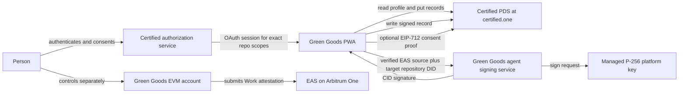

# Certified ATProto identity topology memo

Date: 2026-07-13  
Status: Proposed for human review  
Decision: Pattern A with user-delegated PDS writes

## Claim labels

- **[D] Documented:** verified in the Green Goods repository, the pinned `hypercerts-lexicon` v1.1.0 tag, the inspected Certified source revision, or an official AT Protocol source.
- **[I] Inferred:** an architectural conclusion from documented behavior.
- **[S] Speculative:** a proposal that still requires implementation or external validation.

## Decision

**[D]** Certified creates and controls the user's AT Protocol DID and hosts the user's repository on its PDS. The Green Goods integration must not hold rotation keys, mutate DID governance, or pretend that an EVM account owns the DID.

**[I]** The primary topology is Pattern A:

1. Green Goods is an AT Protocol OAuth client.
2. The user authorizes Green Goods against the authorization server selected for the user's Certified identity.
3. Green Goods reads `app.certified.actor.profile` and writes narrowly scoped records into that same user's repository.
4. The user separately selects one of the existing Green Goods EVM transaction modes.
5. When the selected address can produce the current `app.certified.link.evm#eip712Proof`, Green Goods writes a link record after explicit consent.
6. After a Green Goods EAS attestation is confirmed, Green Goods mirrors the public, approved subset into hypercerts lexicon records in the user's PDS.
7. A stable Green Goods platform key signs each mirrored record for provenance. The user's OAuth authorization permits the write. It is not the platform provenance signature.

**[S]** Pattern C, in which Green Goods issues and governs a separate `did:web` for a person without a Certified identity, is out of scope for the first milestone. It needs a separate security, recovery, hosting, privacy, and key-rotation specification. Pattern C is not a fallback for writing to an existing Certified DID when Certified OAuth scopes are unavailable.

## Topology



## Trust boundaries

| Boundary                 | Authority                                                       | Permitted action                                                                  | Not permitted                                                                             | Claim |
| ------------------------ | --------------------------------------------------------------- | --------------------------------------------------------------------------------- | ----------------------------------------------------------------------------------------- | ----- |
| Certified identity       | Certified and the user                                          | Authenticate the user, host the DID and PDS, authorize exact OAuth scopes         | Green Goods cannot rotate, recover, or govern the DID                                     | [D]   |
| User PDS write           | User-delegated Green Goods browser session                      | Read the profile and create or update approved record collections                 | The agent does not retain user OAuth refresh credentials                                  | [I]   |
| EVM account              | User's passkey Kernel account, embedded wallet, or external EOA | Submit EAS attestations and, when supported, prove address consent                | One address must not silently stand for all three modes                                   | [D]   |
| EVM link proof           | Address signer                                                  | Bind one DID, address, chain context, timestamp, and nonce                        | It does not prove that Green Goods produced the record                                    | [D]   |
| Record provenance        | Green Goods platform signing key                                | Sign the canonical record CID for the named housing repository DID                | It does not prove wallet consent or grant PDS write access                                | [D]   |
| Source verification      | Green Goods agent                                               | Verify the EAS UID and public source fields before signing a deterministic record | It must not sign an arbitrary caller-supplied CID                                         | [S]   |
| Public record visibility | User plus Green Goods product policy                            | Publish only explicitly approved public MRV fields                                | Private media, personal identifiers, and sensitive location must not be copied by default | [I]   |

## OAuth dependency

**[D]** The inspected Certified application is itself an AT Protocol OAuth client and currently requests `atproto transition:generic identity:handle account:email`. The inspected ePDS source contains granular OAuth scope support. Neither source proves that the deployed `certified.one` service currently accepts an independently registered Green Goods client or grants the required `repo:*` write scopes.

**[D]** A live authorization flow against a real Certified account was not available in this research pass. The external gate remains open.

**[S]** Green Goods should request only the collections needed by the active milestone. The milestone-one request is:

```text
atproto
repo:app.certified.link.evm?action=create&action=update
repo:org.hypercerts.claim.activity?action=create&action=update
repo:org.hypercerts.context.attachment?action=create&action=update
```

**[S]** Profile reading should use the public repo read path when the user's profile is public. If Certified requires an explicit read permission set, the final client metadata must use the exact scope syntax Certified publishes. Green Goods should not ship `transition:generic` as a permanent substitute for granular scopes.

## Failure mode if Certified does not grant third-party write scopes

**[I]** Flow A can degrade to Certified sign-in and public profile prefill if authentication and profile reads are available. Flow B cannot meet the stated PDS mirror goal without user-delegated write authority.

**[I]** The correct behavior is:

1. Mark mirror jobs as blocked by provider capability, without consuming retry attempts.
2. Keep the confirmed EAS attestation and its local reconciliation record.
3. Offer a resumable retry after Certified enables the scope or the user reauthorizes.
4. Optionally export the validated record payload for user-controlled import, if Certified supplies such a path.
5. Do not ask for a password or app password, do not place user OAuth tokens in the agent, and do not create a replacement DID for an existing Certified user.

**[I]** If Certified provides authentication but no third-party writes, milestone one is blocked. It must not be described as end to end.

## Address decision

**[D]** Green Goods currently resolves a different primary address for wallet, passkey, and embedded modes. `app.certified.link.evm` is a record about one explicit address and its proof.

**[I]** The rule is additive address consent:

- Link the current Green Goods primary address only after that exact account signs the appropriate proof.
- Preserve prior valid link records when the user changes Green Goods auth mode.
- Never overwrite one link record with a different address merely because the active mode changed.
- Store the app's preferred address separately from the cryptographic link records.
- Milestone one supports an external EOA. Embedded-wallet support is admitted only after its provider proves the same EIP-712 flow in an end-to-end test.
- Passkey Kernel accounts do not receive `app.certified.link.evm` in milestone one because v1.1.0 has no ERC-1271 or ERC-6492 proof variant.

## Platform provenance decision

**[S]** Green Goods should use one long-lived P-256 platform key, identified by a stable Green Goods verification method such as `did:web:greengoods.app#certified-records-2026-01`. The private key must be non-exportable in managed KMS or HSM custody. The public verification method must remain resolvable for as long as signed records are expected to verify.

**[I]** P-256 is recommended because the lexicon signing scheme supports it through multicodec `0x1200`, it is widely available in managed signing services, and it does not couple platform provenance to any user's EVM curve. A separate key must be used for OAuth client authentication if Green Goods later adopts a confidential OAuth backend.

## Pattern C boundary

**[S]** A future no-Certified-user path could create a Green Goods-governed `did:web` whose recovery policy consults a smart-account authorization. That design would make Green Goods an identity issuer and recovery operator. It introduces availability, rotation, account recovery, domain continuity, and privacy obligations absent from Pattern A.

**[I]** Pattern C is therefore outside the first milestone and outside the initial Certified integration delivery. It can proceed only after a separate threat model and explicit product approval.

## Approval gates

1. **[S] External:** Certified confirms Green Goods client registration and exact production scopes on `certified.one`.
2. **[S] External:** Hypercerts publishes `@hypercerts-org/lexicon` v1.1.0 to npm or approves the tagged-release consumption method. As checked on 2026-07-13, the v1.1.0 GitHub tag exists while npm `latest` resolves to v1.0.0.
3. **[S] Internal:** Green Goods approves the public-record visibility policy and coarse-location policy.
4. **[S] Internal:** Infrastructure selects the managed P-256 KMS or HSM and publishes the stable verification method.
5. **[S] Internal:** Product accepts external EOA as the only cryptographic DID-to-EVM link in milestone one.

## Evidence

- [D] Green Goods auth modes: `packages/shared/src/types/auth.ts:8-15`.
- [D] Primary-address resolution: `packages/shared/src/hooks/auth/usePrimaryAddress.ts:31-58`.
- [D] EVM sender boundary: `packages/shared/src/modules/transactions/types.ts:23-50`.
- [D] Envio exclusion from EAS: `packages/indexer/AGENTS.md:5-22`.
- [D] [`hypercerts-lexicon` v1.1.0 schemas](https://github.com/hypercerts-org/hypercerts-lexicon/blob/v1.1.0/SCHEMAS.md).
- [D] [`app.certified.link.evm` v1.1.0](https://github.com/hypercerts-org/hypercerts-lexicon/blob/v1.1.0/lexicons/app/certified/link/evm.json).
- [D] [Certified OAuth client at inspected revision](https://github.com/hypercerts-org/certified-app/blob/6788152c3c6318c3384633b9ccc26d512ed2469e/src/lib/auth/oauth-client.ts).
- [D] [AT Protocol OAuth scopes](https://atproto.com/specs/oauth#scopes).
- [D] [AT Protocol browser OAuth client](https://www.npmjs.com/package/@atproto/oauth-client-browser/v/0.4.8).
